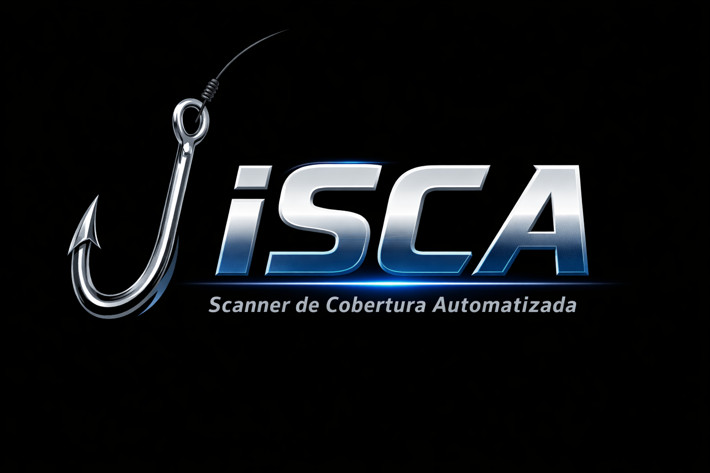

# iSCA
<p align="center">
  
</p>


<h1 align="center">iSCA</h1>

<p align="center">
<b>Initial Scanner de Cobertura Automatizado</b><br>
Ferramenta de Recon automatizado para descoberta de superfície de ataque
</p>

<p align="center">


</p>

---

# 🎣 iSCA — Initial Scanner de Cobertura Automatizado

O **iSCA (Initial Scanner)** é uma ferramenta desenvolvida para **automatizar o processo inicial de reconhecimento em aplicações web**.

A ideia é **mapear rapidamente a superfície de ataque de um domínio**, coletando o máximo de informações possíveis para análise posterior em processos de:

- Bug Bounty
- Pentest
- Red Team
- Security Research

Inspirado em metodologias modernas de **Recon Automation** utilizadas por pesquisadores de segurança.

---

# ⚡ Features

✔ Descoberta de subdomínios  
✔ Enumeração de endpoints  
✔ Coleta de URLs históricas  
✔ Descoberta de parâmetros  
✔ Fuzzing inicial  
✔ Verificação de hosts ativos  
✔ Organização automática dos resultados  

---

# 🧠 Objetivo

O objetivo do **iSCA** é realizar um **scan inicial completo de cobertura**, ajudando a responder rapidamente:

- Quais subdomínios existem?
- Quais endpoints existem?
- Existem parâmetros interessantes?
- Existem serviços expostos?
- Existem possíveis vetores de ataque?

Isso cria uma **base sólida para exploração manual posterior**.

---

# 🧰 Ferramentas Utilizadas

O iSCA integra várias ferramentas comuns no ecossistema de **recon para bug bounty**:

- subfinder
- assetfinder
- httpx
- gau
- waybackurls
- katana
- nuclei
- naabu
- ffuf
- dnsx

---

# 📂 Estrutura do Projeto

iSCA
│
├── initial-scanner.sh
├── README.md
│
├── assets
│ └── banner.png
│
└── output
└── target.com
├── subdomains.txt
├── alive.txt
├── urls.txt
├── params.txt
└── scan-results.txt


---

# 🚀 Instalação

Clone o repositório:

```bash
git clone https://github.com/ElBu3no/iSCA.git
cd iSCA

Dê permissão ao script:

chmod +x initial-scanner.sh
▶️ Uso

Execução básica:

./initial-scanner.sh target.com

Execução com opções:

./initial-scanner.sh -d target.com -o output
⚙️ Parâmetros
Parâmetro	Descrição
-d	domínio alvo
-o	pasta de saída
-p	scan de portas
-f	fuzzing de diretórios
-a	modo agressivo

Exemplo:

./initial-scanner.sh -d target.com -p -f -a
📊 Fluxo de Recon

O fluxo do scanner segue a seguinte lógica:


Target
 │
 ├─ Subdomain Enumeration
 │
 ├─ Host Discovery
 │
 ├─ URL Collection
 │
 ├─ Parameter Discovery
 │
 ├─ Endpoint Discovery
 │
 └─ Initial Vulnerability Scan

🎯 Casos de Uso

O iSCA pode ser usado para:

Recon em Bug Bounty

Pentests Web

Mapeamento de ativos

Surface Discovery

Recon automatizado

⚠️ Aviso Legal

Esta ferramenta foi criada apenas para fins educacionais e testes autorizados.

Nunca utilize esta ferramenta contra sistemas sem permissão explícita.

O autor não se responsabiliza por qualquer uso indevido.

👨‍💻 Autor

Lhuan Bueno

Cybersecurity • Pentest • Bug Bounty

GitHub
https://github.com/ElBu3no

⭐ Contribuições

Pull requests são bem-vindos!

Se você tiver ideias para melhorar o iSCA:

novas integrações

novas técnicas de recon

melhorias no fluxo

Abra uma issue ou PR.

📌 Roadmap

 Docker version

 Parallel scanning

 JSON output

 Recon dashboard

 API mode

 Bug bounty templates

🏴‍☠️ Happy Hunting

---

💡 **Sugestão forte para seu projeto (experiência de quem vê muitos repos de bug bounty):**

Se quiser, posso também te ajudar a criar:

- **versão PRO do README (nível ferramenta famosa)**  
- **diagrama visual do recon**
- **GIF do scanner rodando**
- **estrutura de outputs profissional**
- **script iSCA v1.0 completo**

Isso faz seu repo parecer **uma ferramenta real de segurança usada por hunters**.
